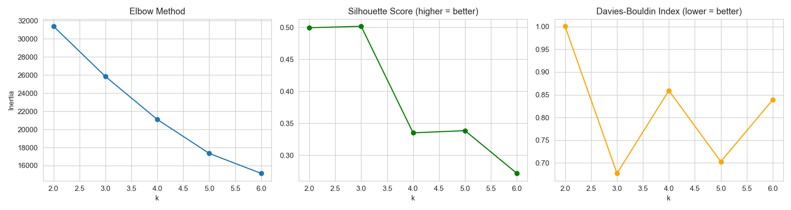
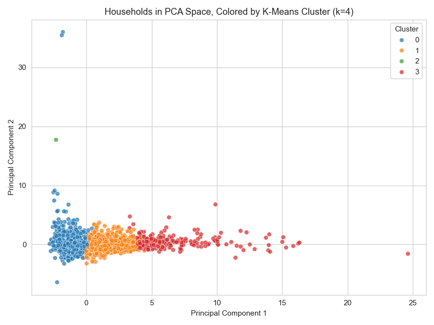
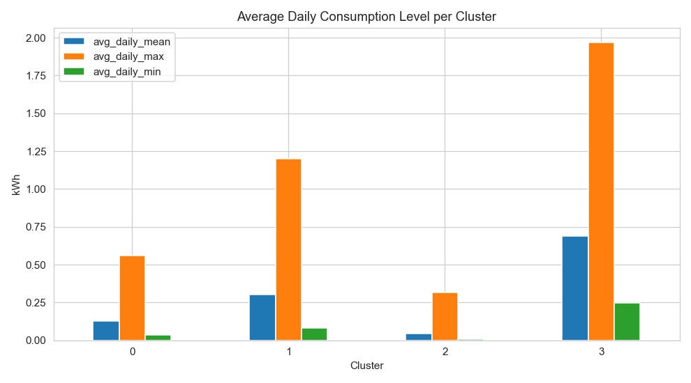
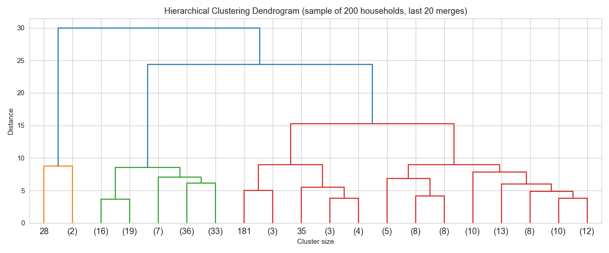
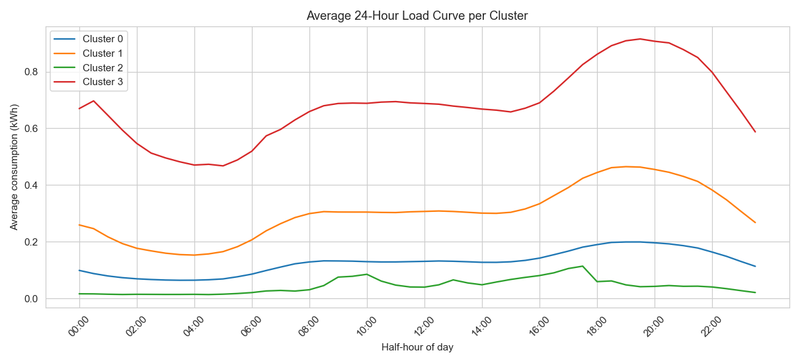

# Electricity Consumption Pattern Analysis

Clustering London households by electricity consumption behaviour, using the
**Smart Meters in London** smart-meter dataset. The project groups ~5,500 households
into behavioural segments (not just "big house vs. small house"), validates the
clusters statistically, visualizes them, profiles their peak/off-peak usage, and
generates a cluster-specific energy-saving recommendation for each segment.

## Contents

| Path | What it is |
|---|---|
| [`Electricity_Clustering_Analysis.ipynb`](Electricity_Clustering_Analysis.ipynb) | The original, step-by-step notebook with explanatory markdown between every step |
| [`electricity_clustering_analysis.py`](electricity_clustering_analysis.py) | The same pipeline as a standalone, runnable script (functions + CLI + model evaluation) |
| [`data/`](data) | A bundled, reproducible sample of the dataset + full column reference + link to the complete Kaggle dataset |
| [`figures/`](figures) | All plots, saved as individual PNGs (generated from the **full** dataset) |
| [`outputs/`](outputs) | `household_clusters_output.csv` (every household + its cluster labels) and `model_evaluation.csv` (clustering metrics), from the full-dataset run |
| [`requirements.txt`](requirements.txt) | Python dependencies |

## Dataset

**[Smart Meters in London](https://www.kaggle.com/datasets/jeanmidev/smart-meters-in-london)**
(Kaggle / UK Power Networks "Low Carbon London" project): half-hourly electricity
readings from 5,567 London households, Nov 2011 – Feb 2014, plus household tariff/Acorn
demographic metadata and local weather.

This repo bundles a **400-household reproducible sample** of the dataset (see
[`data/README.md`](data/README.md) for exactly what's included, the column reference,
and how to download the full ~12 GB dataset from Kaggle to reproduce the headline
figures below exactly).

## Method

1. **Load & clean** — drop days with unrecoverable missing summary stats, keep only
   households with ≥200 recorded days (so an average isn't built from a handful of
   days), drop exact duplicate `(household, day)` rows.
2. **Feature engineering** — collapse ~3.5M daily rows into **one row per household**
   describing its consumption "personality":
   - `avg_daily_mean/std/max/min`, `total_consumption` — overall level
   - `variability_ratio` = std ÷ mean — steady vs. erratic day-to-day usage
   - `weekend_to_weekday_ratio` — weekday-heavy (e.g. empty during office hours) vs.
     weekend-heavy household
   - `winter_to_summer_ratio` — how much usage grows in winter (heating-driven)
   These ratio features are what separate *behavioural* patterns rather than just
   overall size.
3. **Scale** — `StandardScaler` (mean 0, std 1) so `total_consumption` (thousands)
   doesn't dominate `variability_ratio` (~0–2) in distance calculations.
4. **Reduce to 2D with PCA** — for visualization only. Clustering itself runs on the
   full 8-feature scaled matrix, not the 2 PCA components.
5. **Choose k** — scan K-Means for k = 2..6, using the elbow (inertia), silhouette
   score, and Davies-Bouldin index together (see [Choosing k](#choosing-k-and-why-4-not-3) below).
6. **Cluster** three ways — **K-Means**, **Agglomerative (Ward)**, and **DBSCAN**
   (density-based, flags outlier households as noise instead of forcing them into a
   cluster) — and evaluate all three with the same internal validity metrics.
7. **Profile & validate** — per-cluster feature averages (to name each cluster) and a
   cross-tab against the Acorn demographic group, which was **never used to build the
   clusters** — agreement here is a sanity check that the clusters reflect something
   real.
8. **Peak/off-peak analysis** — day-type level (season × weekday/weekend) from the
   bundled data, or true hour-of-day load curves if you add the optional
   `hhblock_dataset` (48 half-hourly columns/day) from the full Kaggle download.
9. **Recommendation engine** — a small rule-based function that turns each cluster's
   profile into a plain-language, actionable recommendation.

## Results (full dataset, 5,530 households after cleaning)

### Choosing k, and why 4, not 3

| k | Silhouette ↑ | Davies-Bouldin ↓ |
|---|---|---|
| 2 | 0.499 | 1.001 |
| **3** | **0.501** | **0.677** |
| 4 | 0.335 | 0.859 |
| 5 | 0.338 | 0.703 |
| 6 | 0.272 | 0.839 |

By the numbers alone, **k=3 scores best on both metrics** — its clusters are tighter
and more separated. **k=4 was used for the headline results anyway**, because at k=3
the highest-consuming households (total consumption ~2–3× the next group, strong
winter/electric-heating signature) get folded into the same cluster as a much larger,
merely-above-average group — losing exactly the distinction a utility would care most
about for demand-response targeting and tariff design. k=4 splits that group out as a
clean, well-separated segment (see the profile table below) at a real but modest cost
in silhouette/DB score. This is a judgment call, not a hard rule — `--best-k 3` is one
flag away if you want the metric-optimal clustering instead.



### Cluster profile (K-Means, k=4)

| Cluster | n | avg daily mean (kWh) | total consumption (kWh) | winter/summer ratio | weekend/weekday ratio | Profile |
|---|---|---|---|---|---|---|
| 0 | 3,449 | 0.129 | 3,868 | 1.91 | 1.05 | Low, steady baseline usage |
| 1 | 1,823 | 0.304 | 9,200 | 1.66 | 1.07 | Moderate, close-to-average usage |
| 2 | 1 | 0.044 | 1,471 | 169,772* | 1.10 | Outlier — near-zero summer usage |
| 3 | 257 | 0.689 | 20,883 | 2.97 | 0.99 | High consumption, strong winter/heating signature |

\* Cluster 2 is a single household with effectively zero recorded summer consumption,
producing a division-by-near-zero ratio — a good example of why DBSCAN (below) is
useful alongside K-Means: it would flag this household as noise instead of forcing it
into a "cluster" of one.





### Model evaluation — K-Means vs. Agglomerative vs. DBSCAN (k=4)

| Model | Clusters found | Silhouette ↑ | Davies-Bouldin ↓ | Noise points |
|---|---|---|---|---|
| K-Means | 4 | 0.335 | 0.859 | 0 |
| Agglomerative (Ward) | 4 | 0.288 | 0.897 | 0 |
| DBSCAN (eps=1.2, min_samples=15) | 1 | — | — | 298 |

K-Means gives the best separation of the two partition-based methods. DBSCAN, with
these parameters, doesn't find multiple density-separated clusters in this feature
space — it collapses almost everything into one dense region and flags 298 households
(~5.4%) as noise/outliers. Those 298 are worth a manual look in a real deployment
(possibly faulty meters, or genuinely unusual households) rather than being forced into
a K-Means cluster. Full numbers: [`outputs/model_evaluation.csv`](outputs/model_evaluation.csv).

### Acorn demographic cross-check (validation only — not used to build the clusters)

| Cluster | ACORN- | ACORN-U | Adversity | Affluent | Comfortable |
|---|---|---|---|---|---|
| 0 | 1 | 27 | 1,288 | 1,224 | 909 |
| 1 | 1 | 13 | 484 | 773 | 552 |
| 2 | 0 | 0 | 1 | 0 | 0 |
| 3 | 0 | 9 | 26 | 184 | **38** |

Cluster 3 (the high-consumption, strong-heating group) skews noticeably toward
Affluent/Comfortable relative to its size — a data-driven cluster built purely from
consumption *shape* lining up with an independent demographic signal is a reasonable
sanity check that it's capturing something real, not noise.

### Peak / off-peak usage

Day-type level (season × weekday/weekend, from the bundled data):

| Cluster | Peak | Off-peak |
|---|---|---|
| 0 | Winter weekend (0.149 kWh avg) | Summer weekday (0.112 kWh avg) |
| 1 | Winter weekend (0.377 kWh avg) | Summer weekday (0.238 kWh avg) |
| 2 | Winter weekend (0.107 kWh avg) | Summer weekend (0.000 kWh avg) |
| 3 | Winter weekday (0.892 kWh avg) | Summer weekend (0.443 kWh avg) |

True hour-of-day (from the optional `hhblock_dataset`, half-hourly resolution):

| Cluster | Peak | Off-peak |
|---|---|---|
| 0 | 19:30 (0.200 kWh avg) | 03:30 (0.065 kWh avg) |
| 1 | 19:00 (0.465 kWh avg) | 04:00 (0.153 kWh avg) |
| 2 | 17:30 (0.114 kWh avg) | 04:30 (0.014 kWh avg) |
| 3 | 19:30 (0.915 kWh avg) | 05:00 (0.468 kWh avg) |

Every cluster peaks in the early evening (17:30–19:30) — expected for a residential
population — but cluster 3 (highest consumers) peaks earliest and hardest, making it
the most useful target for a demand-response program aimed at flattening the
grid-wide evening peak.



### Recommendations generated per cluster

- **Cluster 0** (low, steady, n=3,449) — strong winter increase suggests electric
  heating; recommend a smart thermostat / heating schedule.
- **Cluster 1** (moderate, n=1,823) — close to average; general efficiency tips (LED
  lighting, standby power audit).
- **Cluster 2** (outlier, n=1) — flagged for manual review rather than a generic
  recommendation, given the near-zero summer usage.
- **Cluster 3** (high consumption, n=257) — strong winter increase + earliest evening
  peak; best candidate for both a heating-schedule intervention and a demand-response
  program, since it drives a disproportionate share of the grid-wide evening peak.

## How this supports smart energy management

- **Targeted demand response**: cluster 3 peaks earliest and hardest in the evening —
  the best target for a demand-response alert aimed at flattening the grid peak.
- **Tariff design**: clusters with a high `winter_to_summer_ratio` (0, 3) are good
  candidates for a heating-season-aware tariff rather than a flat rate.
- **Infrastructure planning**: relative cluster sizes (from `value_counts()`) give a
  rough read on what share of a neighbourhood falls into each usage pattern — useful
  for transformer/feeder sizing.
- **Personalized guidance**: the Step 12 recommendation engine generates a message per
  cluster instead of one generic message to everyone.
- **Outlier handling**: DBSCAN's 298 noise-labelled households are worth a manual
  look — possibly faulty meters, or genuinely unusual consumption a rigid K-Means
  cluster would otherwise have forced into the nearest group anyway.

## Running it yourself

```bash
git clone https://github.com/Param031010/Electricity_Consumption_Pattern_Analysis.git
cd Electricity_Consumption_Pattern_Analysis
pip install -r requirements.txt

# Notebook (uses the bundled data/ sample by default — edit DATA_DIR in the first code cell)
jupyter notebook Electricity_Clustering_Analysis.ipynb

# Script (same pipeline, runnable end-to-end)
python electricity_clustering_analysis.py --data-dir data --figures-dir figures --output-dir outputs

# With the full Kaggle dataset + true hourly peak analysis
python electricity_clustering_analysis.py \
    --data-dir /path/to/full/kaggle/dataset \
    --hhblock-dir /path/to/full/kaggle/dataset/hhblock_dataset \
    --best-k 4
```

See `python electricity_clustering_analysis.py --help` for all options
(`--best-k`, `--min-days`, etc.).

## Limitations

- The dataset covers Nov 2011–Feb 2014 only (no post-pandemic, no current tariff
  structures, no EVs/heat pumps at scale) — behavioural patterns from this era may not
  transfer directly to today's grid.
- `daily_dataset.csv` gives daily summary stats, not raw half-hourly readings; the true
  hour-of-day peak analysis (Step 11 / `--hhblock-dir`) requires the much larger
  `hhblock_dataset` files, which aren't bundled in this repo (see
  [`data/README.md`](data/README.md)).
- K-Means assumes roughly spherical, similarly-sized clusters in feature space — the
  size-1 "cluster 2" above is really an outlier the algorithm was forced to place
  somewhere, which is exactly the kind of case DBSCAN handles more honestly (by
  labelling it noise) at the cost of finding fewer distinct clusters overall.
- Acorn demographic data is used only for post-hoc validation, never as a clustering
  input — cross-tab agreement is suggestive, not a formal statistical test.
